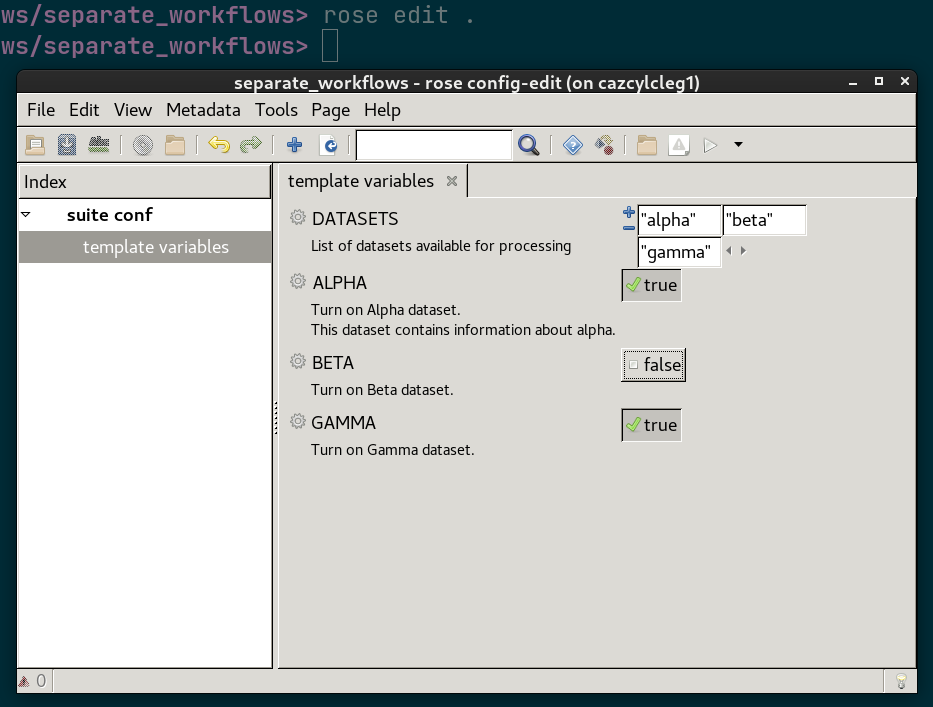

# Switch on a selection of workflows based on user choices.

Demonstrates:

* Having multiple separate workflows.
* Switching based on Rose options.

running

```bash
$ rose edit $PWD
```

Will show a safety-rails inclusive Rose GUI:



Try changing the config and look at the effect using:

```bash
$ cylc graph .
# or
$ cylc view -p .
```